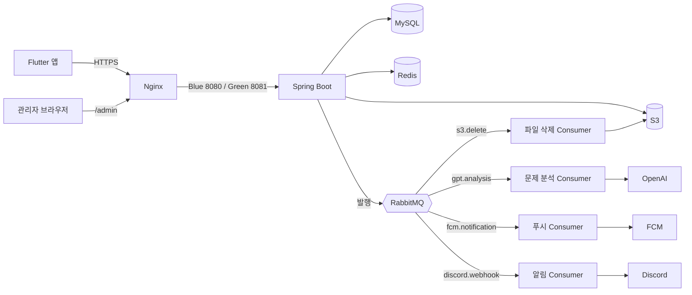
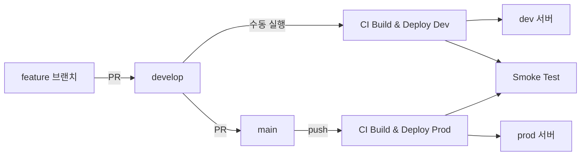

# OnO 백엔드

> OnO 는 틀린 문제를 사진으로 찍어 오답노트를 만들고, 맞힌 기록을 바탕으로 다시 풀 때가 된 문제를 추천해 주는 앱입니다.
> 이 레포는 그 앱이 쓰는 REST API 서버이고, 실사용자가 있는 운영 서비스입니다.
>
> **Spring Boot 서버 하나가 API 와 관리자 화면을 같이 맡고, 오래 걸리는 일(AI 분석, 푸시, 파일 삭제)은 RabbitMQ 로 넘겨 응답과 분리합니다.**

[App Store](https://apps.apple.com/kr/app/오노-ono-손쉬운-나만의-오답노트/id6602886624) | [Google Play](https://play.google.com/store/apps/details?id=com.ono.app) | [사용 가이드](https://ono-guide.notion.site/OnO-3d642b6aecdc8091a875c204f2479e05) | [프론트엔드 레포](https://github.com/AI-SIP/OnO_FRONT)


<br>

## 이 서버가 하는 일

| 영역 | 내용 |
|---|---|
| 오답노트 | 문제 사진과 메모, 폴더, 태그를 저장하고 커서 기반 목록으로 내려줍니다 |
| AI 분석 | 문제 이미지를 OpenAI 에 보내 개념과 풀이 방향, 자주 하는 실수를 정리해 둡니다. 정답은 일부러 계산하지 않습니다 |
| 복습 추천 | 다시 푼 기록(정답, 오답, 부분 정답)으로 다음 복습일을 잡고, 그날이 된 문제를 추천합니다 |
| 복습 알림 | 복습할 때가 된 문제와 복습노트 시간을 FCM 푸시로 알려줍니다 |
| 학습 기록 | 학습 캘린더, 학습 리포트, 미션과 레벨, 업적, 캐릭터 꾸미기를 관리합니다 |
| 스터디룸 | 여러 사용자가 문제를 공유하고 챌린지와 주간 리포트를 받는 방입니다 |
| 관리자 화면 | `/admin` 아래 Thymeleaf 페이지로 사용자, 문제, 피드백, 공지를 봅니다 |

<br>

## 기술 스택

| 구분 | 사용 기술 |
|---|---|
| 언어와 프레임워크 | Java 17, Spring Boot 3.3, Spring Security, Spring Data JPA, QueryDSL |
| 저장소 | MySQL 8.0 (Flyway 로 스키마 관리), Redis 7.2, AWS S3 |
| 비동기와 예약 작업 | RabbitMQ 3.13, Quartz (JDBC JobStore) |
| 외부 연동 | OpenAI Chat Completions, Firebase Cloud Messaging, Discord Webhook |
| 인증 | JWT (Access 30분, Refresh 7일), 소셜 로그인은 앱에서 처리 |
| 배포 | Docker, Docker Hub, GitHub Actions (self-hosted runner), Nginx Blue-Green |
| 관측 | Prometheus, Grafana, Loki, Promtail, Alertmanager, Sentry |
| 테스트 | JUnit 5, Testcontainers, ArchUnit, JaCoCo, PIT |

<br>

## 구성



- **Redis 는 캐시가 아니라 인증과 사용량 제한에 씁니다.** 로그아웃하거나 탈퇴한 사용자의 Access Token 블랙리스트와, 사용자별 하루 호출 제한 카운터가 들어 있습니다. Refresh Token 은 MySQL `refresh_token` 테이블에 있습니다.
- **큐마다 DLQ 가 있습니다.** 실패하면 1초, 2초, 4초 간격으로 세 번까지 다시 시도하고, 그래도 안 되면 `*.dlq` 로 보냅니다. 예전에 무한 재전달로 Discord 알림이 쏟아진 적이 있어서 재큐잉은 꺼 두었습니다.
- **문제 분석 Consumer 는 동시에 1~2개만 돕니다.** OpenAI 호출 한도 때문입니다.

<br>

## 패키지 구조

루트 패키지는 `com.aisip.OnO.backend` 이고, 도메인마다 `controller / service / repository / entity / dto` 를 둡니다.

| 패키지 | 맡는 일 |
|---|---|
| `auth` | JWT 발급과 갱신, 로그아웃, Security 설정 |
| `user` | 계정과 프로필, 탈퇴(soft delete) |
| `problem` | 오답 문제 등록과 조회, AI 분석, 복습 일정 계산과 알림 |
| `problemsolve` | 다시 푼 기록 |
| `practicenote` | 복습노트와 복습 시간 알림 |
| `folder`, `tag` | 문제 분류 |
| `learningcalendar`, `learningreport` | 학습 캘린더와 학습 리포트 |
| `mission`, `achievement`, `cosmetic` | 미션과 레벨, 업적, 캐릭터 꾸미기 |
| `studyroom` | 스터디룸, 챌린지, 공유 문제, 주간 리포트 |
| `notice`, `feedback` | 공지와 사용자 피드백 |
| `admin` | 관리자 화면 |
| `common`, `config`, `util` | 공통 응답과 예외, 인증 필터, RabbitMQ, Redis, Quartz, S3, FCM, OpenAI 설정 |

**모든 조회와 수정은 `userId` 로 소유권을 확인합니다.** 사용자는 자기 오답노트 데이터에만 접근할 수 있습니다.

<br>

## 복습 일정은 이렇게 잡습니다

`ReviewIntervalCalculator` 가 문제를 다시 푼 기록을 처음부터 따라가며 다음 복습일을 계산합니다.

| 결과 | 다음 복습 |
|---|---|
| 정답 | 간격을 두 배로 늘립니다 (최대 30일) |
| 오답, 부분 정답 | 다음 날로 되돌리고 간격도 1일로 초기화합니다 |

- **마지막으로 틀린 뒤 서로 다른 3일에 맞히면 추천에서 빠집니다.** 그 뒤에 다시 틀리면 정답 날을 처음부터 다시 셉니다.
- **기록을 고치거나 지우면 전체 기록으로 다시 계산합니다.** 중간 기록 하나가 바뀌어도 일정이 어긋나지 않게 하기 위해서입니다.

<br>

## 예약 작업

Quartz JDBC JobStore 를 쓰고, 모든 시각은 한국 시간 기준입니다.

| Job | 주기 | 하는 일 |
|---|---|---|
| `ProblemReviewReminderJob` | 5분마다 | 복습할 때가 된 문제 알림을 보냅니다 (09시~21시 사이에만) |
| `ReviewDueNotificationJob` | 매일 09시 | 오늘 복습할 문제 수 알림, 오래 접속하지 않은 사용자에게 다시 오라는 알림 |
| `PracticeNotificationJob` | 사용자가 정한 시각 | 복습노트마다 사용자가 정한 반복 주기와 시각에 알림 |
| `StudyRoomWeeklyReportJob` | 매주 월요일 08시 | 지난주 스터디룸 리포트를 만듭니다 |
| `ChallengeNotificationJob` | 챌린지마다 한 번 | 챌린지 중간 지점과 D-1 알림 |

> 이 Job 들은 실제 사용자에게 푸시를 보냅니다. 발송 경로를 고칠 때는 dev 서버에서 먼저 확인합니다.

<br>

## API

- **문서**: 로컬에서 서버를 띄운 뒤 `/swagger-ui/index.html` 에서 볼 수 있습니다.
- **인증**: `POST /api/auth/signup/guest`, `POST /api/auth/signup/member` 로 토큰을 받고, `Authorization: Bearer <AccessToken>` 헤더로 호출합니다. 만료되면 `POST /api/auth/refresh` 로 Access Token 과 Refresh Token 을 둘 다 새로 받습니다.
- **응답 형식**: 성공과 실패 모두 `CommonResponse` 로 감쌉니다. 값이 없는 필드는 내려가지 않습니다.

```jsonc
// 성공
{ "data": { ... } }

// 실패
{ "errorCode": 1002, "message": "..." }
```

에러 코드는 도메인마다 `ErrorCase` 를 구현한 enum(`AuthErrorCase`, `UserErrorCase` 등)에 모여 있습니다. 앱과 맞춰야 하는 값이라 바꿀 때는 프론트엔드 레포와 같이 확인합니다.

<br>

## 로컬에서 실행하기

### 준비물

- JDK 17, Docker
- `src/main/resources/application-local.yml` 과 루트의 `FirebaseAdminKey.json`. 둘 다 키가 들어 있어 레포에 올리지 않으니 팀원에게 받습니다.
- 루트의 `.env` 에 `MYSQL_ROOT_PASSWORD`, `RABBITMQ_PASSWORD` 를 적어 둡니다.

### 인프라 띄우기

MySQL, Redis, RabbitMQ 를 `docker-compose.local.yml` 로 띄웁니다. Redis 와 RabbitMQ 는 기본 포트가 아니라 하나씩 밀린 포트를 쓰니 주의합니다.

```bash
make up       # 셋 다 healthy 가 될 때까지 기다린 뒤 상태를 보여줍니다
make status   # 다시 확인할 때
make down     # 내리기 (볼륨은 남습니다)
```

| 서비스 | 호스트 포트 |
|---|---|
| MySQL | 3306 |
| Redis | 6380 |
| RabbitMQ | 5673 (관리 화면 15673) |

### 서버 실행

```bash
./gradlew bootRun --args='--spring.profiles.active=local'
```

local 프로필에서는 RabbitMQ Listener 가 꺼져 있어서, 메시지는 큐에 쌓이기만 하고 실제 AI 분석이나 푸시는 나가지 않습니다.

<br>

## 테스트

```bash
make test                                          # 전체 테스트 + 커버리지 리포트
make test-only T='com.aisip.OnO.backend.tag.*'     # 일부만
make coverage                                      # 커버리지 리포트 열기
./gradlew pitest                                   # 뮤테이션 테스트
```

- **Testcontainers 로 MySQL, Redis, RabbitMQ 를 따로 띄웁니다.** 로컬 DB 는 건드리지 않고, Docker 만 켜져 있으면 됩니다.
- **테스트도 한국 시간으로 돕니다.** 운영 JVM 이 `Asia/Seoul` 이라 CI(UTC)와 날짜 경계가 어긋나지 않게 맞춰 두었습니다.
- **ArchUnit 으로 아키텍처 규칙을 검사합니다.** 엔티티 매핑, 시간대, 트랜잭션 경계에서 한 번 고친 실수가 다시 들어오지 않게 막습니다.
- **PR 마다 `Test` 워크플로가 돕니다.** 라인 커버리지 85%, 브랜치 커버리지 70% 아래로 떨어지면 실패합니다.

<br>

## 배포



- **이미지는 GitHub Actions 에서 빌드해 Docker Hub 에 올리고, 서버의 self-hosted runner 가 받아서 띄웁니다.** 태그는 `dev-latest`, `prod-latest` 와 커밋 해시를 같이 붙입니다.
- **prod 는 Blue-Green 으로 무중단 배포합니다.** 지금 떠 있지 않은 쪽 색을 띄우고 healthy 와 스모크 확인을 통과하면 Nginx upstream 을 바꿉니다. 실패하면 이전 이미지로 되돌립니다.
- **스모크 테스트는 배포 직후와 매시간 돕니다.** 상태가 바뀌거나 실패가 이어지면 Discord 로 알려줍니다.
- `deploy-dev.yml`, `deploy-prod.yml` 은 특정 이미지 태그로 다시 띄워야 할 때 쓰는 수동 배포입니다.
- 서버 설정 파일(`application-dev.yml`, `application-prod.yml`)은 레포에 없고 GitHub Secrets 에서 배포할 때 넣습니다.

<br>

## 모니터링

| 도구 | 보는 것 |
|---|---|
| Prometheus, Grafana | Actuator 지표, MySQL과 Redis exporter 지표, 외부 API 응답 시간 |
| Loki, Promtail | 컨테이너 로그 |
| Alertmanager | prod 경보를 Discord 로 보냅니다 |
| Sentry | 처리되지 않은 예외 (이미 처리한 4xx 는 보내지 않습니다) |
| Discord Webhook | 5xx 에러, 배포 결과, 스모크 테스트 결과 |

<br>

## 작업 규칙

- **브랜치**: `develop` 에서 `feat/<이슈번호>-<내용>`, `fix/<이슈번호>-<내용>` 로 따서 `develop` 에 PR 을 올립니다. `main` 은 운영 배포용입니다.
- **커밋 메시지**: 태그는 `[Feat]`, `[Fix]`, `[Refactor]`, `[Chore]`, `[Test]`, `[Docs]`, `[Perf]` 중에서 고릅니다.

  ```
  [Feat] 한 줄 요약
  - 상세 1
  - 상세 2
  ```

- **PR**: 템플릿의 API 호환성, DB 마이그레이션, 인증과 권한 항목을 채웁니다. 이미 배포된 앱 버전이 계속 이 서버를 호출하기 때문에, 응답 필드를 지우거나 이름을 바꾸는 변경은 특히 조심합니다.
- **DB 스키마 변경**: `src/main/resources/db/migration` 에 `V<번호>__<설명>.sql` 로 추가합니다. 자세한 규칙은 그 폴더의 [README](src/main/resources/db/migration/README.md) 에 있습니다.

<br>

## 팀

SW 마에스트로 15기에서 시작한 프로젝트입니다. 문의는 ono.dev.team@gmail.com 으로 보내 주세요.
