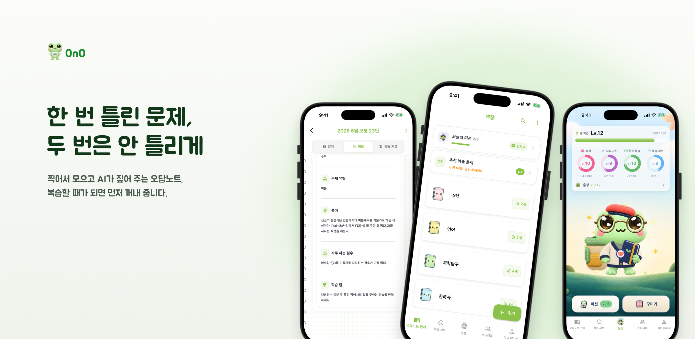
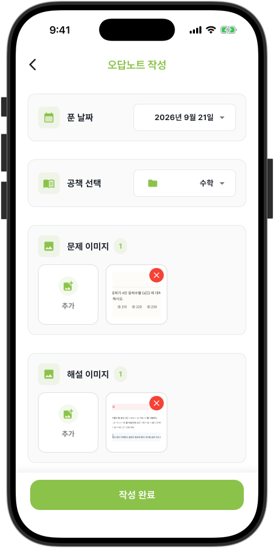
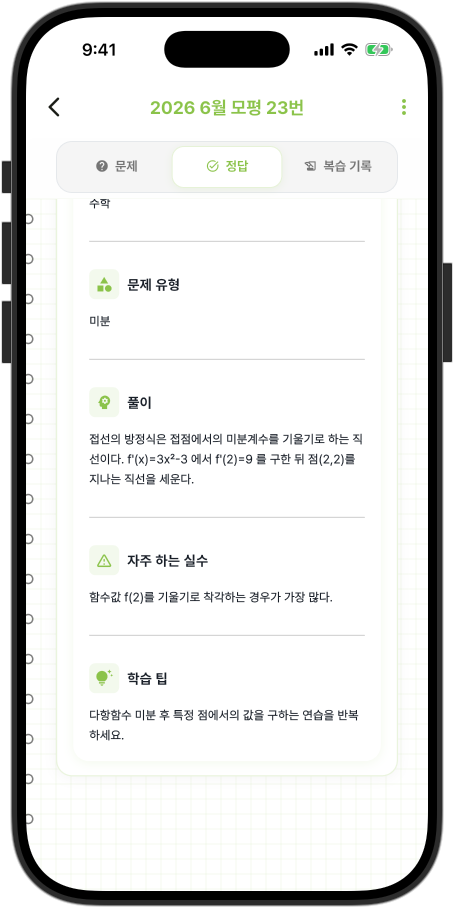
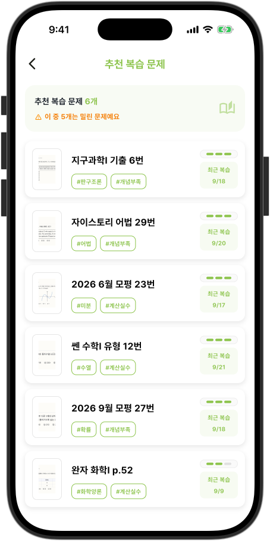
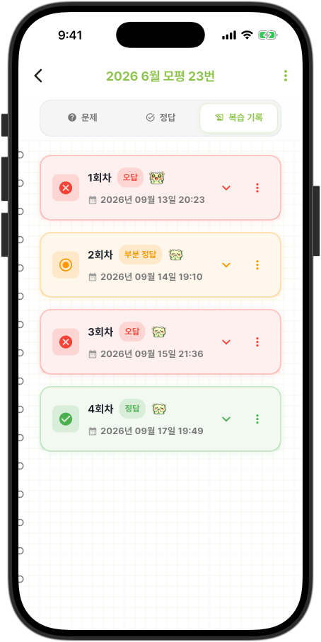
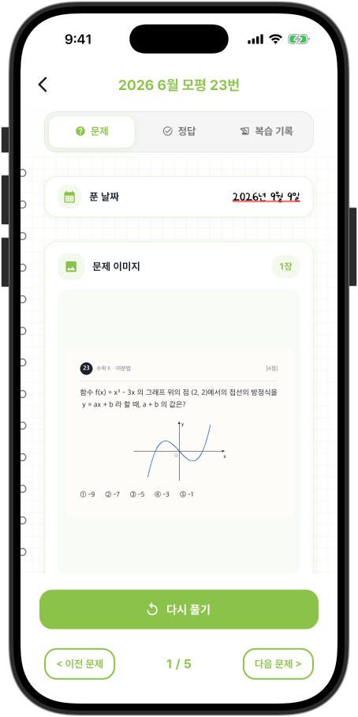
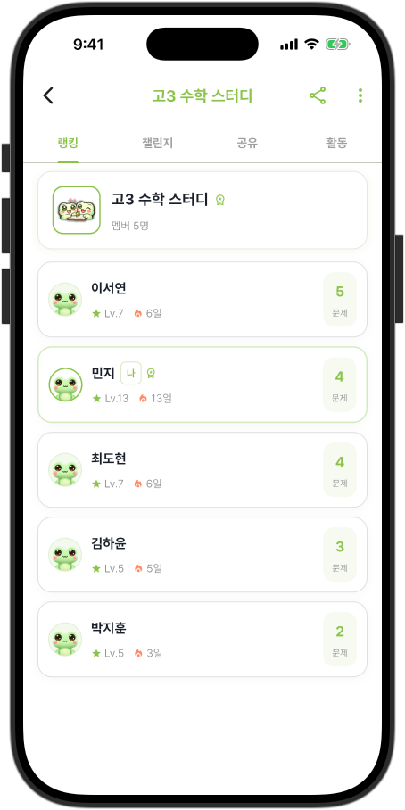
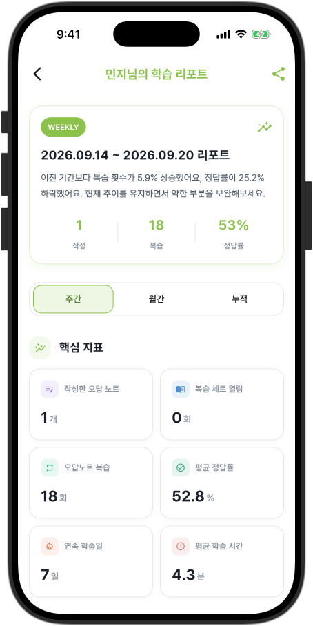
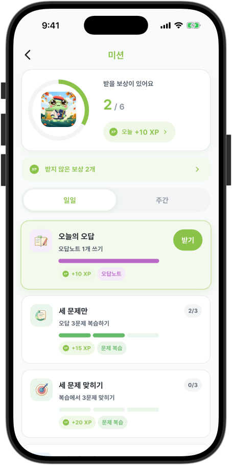
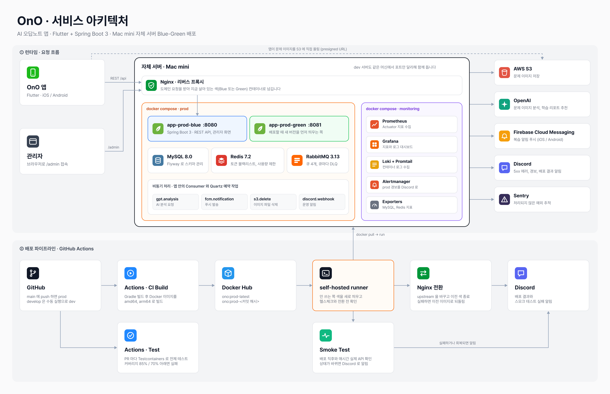

<div align="center">

# OnO Backend

### 손쉽게 작성하는 나만의 AI 오답노트, OnO 의 API 서버

틀린 문제를 찍어 두면 AI 가 분석해 주고, 다시 풀 때가 되면 먼저 알려 줍니다.

<a href="https://apps.apple.com/kr/app/오노-ono-손쉬운-나만의-오답노트/id6602886624"></a>
<a href="https://play.google.com/store/apps/details?id=com.ono.app"></a>
<a href="https://github.com/AI-SIP/OnO_FRONT"></a>



</div>

<br>

## 목차

- [서비스 소개](#서비스-소개)
- [기술 스택](#기술-스택)
- [서비스 아키텍처](#서비스-아키텍처)
- [프로젝트 구조](#프로젝트-구조)

<br>

## 서비스 소개

오답노트가 좋다는 건 다들 알지만, 문제를 옮겨 적고 다시 찾아 푸는 일이 번거로워서 오래 가지 못합니다.
OnO 는 문제를 사진으로 올리면 한 장이 완성되고, 복습할 때가 된 문제를 먼저 모아 주는 앱입니다.
2024년 8월 앱 스토어에 처음 출시했고, 지금도 실사용자가 쓰고 있는 서비스입니다.

아래는 앱의 주요 화면과, 그 화면 뒤에서 이 서버가 하는 일입니다.

<table>
  <tr>
    <td align="center" width="25%"></td>
    <td align="center" width="25%"></td>
    <td align="center" width="25%"></td>
    <td align="center" width="25%"></td>
  </tr>
  <tr>
    <td align="center"><b>오답노트 작성</b><br/><sub>사진은 앱이 S3 에 바로 올리고<br/>서버는 문제와 이미지 주소를 저장합니다</sub></td>
    <td align="center"><b>AI 오답분석</b><br/><sub>등록 응답과 분리해 큐로 넘기고<br/>OpenAI 결과를 나중에 채웁니다</sub></td>
    <td align="center"><b>추천 복습 문제</b><br/><sub>다시 푼 기록으로 다음 복습일을<br/>계산해서 그날 모아 줍니다</sub></td>
    <td align="center"><b>다시 풀기</b><br/><sub>회차마다 정답, 오답, 부분 정답과<br/>풀이 시간을 남깁니다</sub></td>
  </tr>
  <tr>
    <td align="center"></td>
    <td align="center"></td>
    <td align="center"></td>
    <td align="center"></td>
  </tr>
  <tr>
    <td align="center"><b>복습 세트</b><br/><sub>정해 둔 시간이 되면<br/>예약 작업이 푸시를 보냅니다</sub></td>
    <td align="center"><b>스터디룸</b><br/><sub>랭킹과 챌린지, 문제 공유,<br/>매주 월요일 주간 리포트</sub></td>
    <td align="center"><b>학습 리포트</b><br/><sub>학습 지표를 모아 다음 주 목표를 추천하고<br/>AI 가 실패하면 규칙 기반으로 채웁니다</sub></td>
    <td align="center"><b>미션과 레벨</b><br/><sub>일일, 주간 미션 진행도와<br/>경험치, 꾸미기 잠금 해제</sub></td>
  </tr>
</table>

화면별 설명은 [앱 저장소 README](https://github.com/AI-SIP/OnO_FRONT) 에 더 자세히 있습니다.

<br>

## 기술 스택

**Backend**


**Data**


**Infra**


**External**


<br>

## 서비스 아키텍처



<br>

## 프로젝트 구조

```
OnO_BACKEND
├── src/main/java/com/aisip/OnO/backend
│   ├── auth               # JWT 발급과 갱신, Security 설정
│   ├── user               # 계정, 프로필, 탈퇴
│   ├── problem            # 오답노트, AI 분석, 복습 일정 계산과 복습 알림
│   ├── problemsolve       # 다시 푼 기록
│   ├── practicenote       # 복습 세트와 복습 시간 알림
│   ├── folder             # 공책
│   ├── tag                # 태그와 검색
│   ├── learningcalendar   # 학습 달력
│   ├── learningreport     # 학습 리포트와 AI 추천
│   ├── mission            # 일일, 주간 미션과 레벨
│   ├── achievement        # 훈장
│   ├── cosmetic           # 개구리 꾸미기
│   ├── studyroom          # 스터디룸, 챌린지, 문제 공유, 주간 리포트
│   ├── notice             # 공지
│   ├── feedback           # 사용자 피드백
│   ├── admin              # 관리자 화면 (/admin)
│   ├── common             # 공통 응답과 예외, JWT 필터, 사용량 제한
│   ├── config             # RabbitMQ 큐와 Producer, Consumer, Flyway 설정
│   └── util               # S3, FCM, OpenAI, Redis, Quartz, Discord 연동
├── src/main/resources
│   ├── db/migration       # Flyway 마이그레이션
│   └── templates          # 관리자 화면 Thymeleaf 템플릿
├── src/test               # Testcontainers 기반 테스트
├── monitoring             # Prometheus, Grafana, Loki, Alertmanager 설정
├── scripts/smoke          # 배포 후와 매시간 도는 스모크 테스트
├── .github/workflows      # 테스트, 빌드와 배포, 스모크 테스트
└── docker-compose.*.yml   # local, dev, prod 컨테이너 구성
```

<br>

<div align="center">
<sub>문의 ono.dev.team@gmail.com</sub>
</div>
